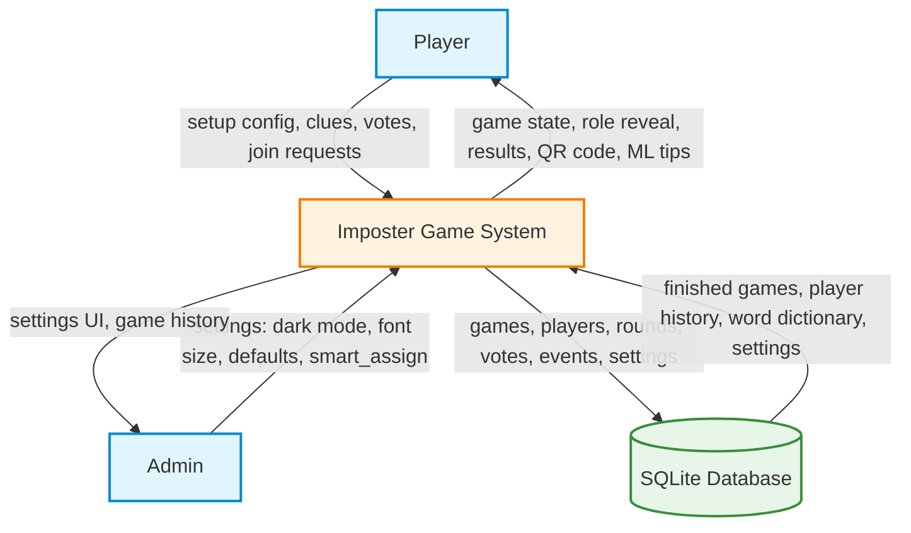

# Level 0 Context Diagram

```mermaid
graph TD
    P["Player"]:::entity
    A["Admin"]:::entity
    DB[("SQLite Database")]:::store

    SYS["Imposter Game System"]:::system

    P -->|"setup config, clues, votes, join requests"| SYS
    SYS -->|"game state, role reveal, results, QR code, ML tips"| P

    A -->|"settings: dark mode, font size, defaults, smart_assign"| SYS
    SYS -->|"settings UI, game history"| A

    SYS -->|"games, players, rounds, votes, events, settings"| DB
    DB -->|"finished games, player history, word dictionary, settings"| SYS

    classDef entity fill:#e1f5fe,stroke:#0288d1,stroke-width:2px
    classDef system fill:#fff3e0,stroke:#f57c00,stroke-width:2px
    classDef store fill:#e8f5e9,stroke:#388e3c,stroke-width:2px
```
