```mermaid
flowchart TD
    %% External entities
    Player(("Player")):::entity
    Admin(("Admin")):::entity

    %% Data stores
    DB[("SQLite Database")]:::store
    Words[("words.json cache")]:::store
    Models[("knn_model.pkl\nlr_model.pkl")]:::store

    %% === Level 1 Processes ===
    subgraph SingleDevice["Single-Device Play"]
        SD_HTTP["Web Routes\nroutes/game.py\ncreate_local_game(),\nsubmit_clue(), submit_vote()"]:::process
        SD_GAME["Game Logic\ngame_logic.py\nassign_roles(), check_win(),\neliminate_top_voted()"]:::process
        SD_SEC["Security\nsecurity.py\nvalidate_clue(),\nvalidate_player_name(),\ngame_session_required"]:::process
    end

    subgraph MultiDevice["Multi-Device Play"]
        MD_HTTP["Web Routes\nroutes/game.py\nmulti_host_create(),\nmulti_join(), multi_play()"]:::process
        MD_SOCK["SocketIO Events\nsocketio_events.py\nsubmit_clue, cast_vote,\nadvance_phase"]:::process
        MD_SEC["Security\nsecurity.py\nrate_limit(),\nvalidate_clue(),\nstrip_html()"]:::process
    end

    subgraph SharedEngine["Shared Engine"]
        GL["Game Logic\ngame_logic.py\n(same file as Single-Device)"]:::process
        VOTE["ML Vote Bot\nml/vote_bot.py\nbot_vote()"]:::process
        GUESS["ML Word Bot\nml/word_bot.py\nbot_guess()"]:::process
        WORDS["Word Dictionary\nwords.py\nrandom_word(),\nget_word_categories()"]:::process
    end

    subgraph SRA["Smart Role Assignment"]
        SRA_MAIN["ml/assignment.py\nbalanced_role_assign(),\npick_starting_player(),\nget_player_stats()"]:::process
    end

    subgraph AI["AI Insights System"]
        AI_MAIN["ml/insights.py\npredict_winner(),\nbalanced_word(),\nget_category_difficulty(),\nrandom_tip(),\nseed_example_games()"]:::process
    end

    %% === Level 1 Data Flows ===
    %% Player -> Single-Device
    Player -->|"player_name[]: list[str],<br/>imposter_count: int,<br/>jester_count: int,<br/>clue: str, voter_id + target_id: int"| SD_HTTP

    %% Player -> Multi-Device
    Player -->|"player_name[]: list[str],<br/>imposter_count: int,<br/>jester_count: int,<br/>room_code + token + clue + target_id: str"| MD_HTTP
    Player -->|"SocketIO events:<br/>join_game, submit_clue,<br/>cast_vote, advance_phase"| MD_SOCK

    %% Admin -> Settings (implicit via DB)
    Admin -->|"dark_mode: bool,<br/>font_size: int,<br/>smart_assign: bool,<br/>default counts: int"| DB

    %% === Level 2 Data Flows ===

    %% Smart Role Assignment -> Game Creation (both modes)
    SRA_MAIN -->|"players_data mutated in-place:<br/>[{'name': str, 'role': str}, ...]"| SD_HTTP
    SRA_MAIN -->|"players_data mutated in-place:<br/>[{'name': str, 'role': str}, ...]"| MD_HTTP
    SRA_MAIN -->|"starter_name: str"| SD_HTTP
    SRA_MAIN -->|"starter_name: str"| MD_HTTP

    %% AI Insights -> Game Creation
    AI_MAIN -->|"balanced_word: str or None<br/>(weighted toward fair words)"| SD_HTTP
    AI_MAIN -->|"balanced_word: str or None"| MD_HTTP
    AI_MAIN -->|"balanced_category: str or None<br/>(weighted toward fair categories)"| SD_HTTP
    AI_MAIN -->|"balanced_category: str or None"| MD_HTTP

    %% AI Insights -> Templates (UI)
    AI_MAIN -->|"category_difficulty: list[dict]<br/>{name, crewmate_pct, imposter_pct, label}"| SD_HTTP
    AI_MAIN -->|"category_difficulty: list[dict]"| MD_HTTP
    AI_MAIN -->|"random_tip: str or None"| SD_HTTP
    AI_MAIN -->|"random_tip: str or None"| MD_HTTP
    AI_MAIN -->|"prediction: (role_label: str, confidence: float)"| SD_HTTP
    AI_MAIN -->|"prediction: (role_label: str, confidence: float)"| MD_HTTP

    %% Single-Device internal flow: HTTP -> Security -> Game Logic
    SD_HTTP -->|"validated name: str"| SD_SEC
    SD_SEC -->|"name passes regex<br/>^[\\w\\s\\-'.]{1,50}$"| SD_GAME
    SD_HTTP -->|"validated clue: str"| SD_SEC
    SD_SEC -->|"clue passes blocklist:<br/>len<=100, no <script,<br/>drop table, union select, --, /*"| SD_GAME
    SD_HTTP -->|"validated IDs: int"| SD_SEC
    SD_SEC -->|"validate_positive_int()"| SD_GAME
    SD_HTTP -->|"session check"| SD_SEC
    SD_SEC -->|"403 or pass"| SD_GAME

    %% Multi-Device internal: HTTP/WS -> Security -> Game Logic
    MD_HTTP -->|"validated inputs"| MD_SEC
    MD_SOCK -->|"rate_limit(sid): bool<br/>10 events/sec sliding window"| MD_SEC
    MD_SEC -->|"passed"| GL

    %% Shared Game Logic
    SD_GAME <-->|"same functions imported"| GL
    SD_GAME -->|"alive_players: list[Player],<br/>all_clues_submitted: bool,<br/>tally_votes: Counter,<br/>eliminate_top_voted: Player or None,<br/>check_win_condition: str or None"| MD_HTTP
    GL -->|"same function outputs"| MD_SOCK

    %% Word Dictionary
    WORDS -->|"random_word(category): dict<br/>{word, category_id, word_length,<br/>commonality}"| GL
    WORDS -->|"get_word_categories(): list[str]"| SD_HTTP
    WORDS -->|"get_word_categories(): list[str]"| MD_HTTP

    %% ML Vote Bot
    SD_HTTP -->|"game_state: dict<br/>{players, round_number,<br/>vote_counts, clues,<br/>secret_word, bot_role}"| VOTE
    VOTE -->|"target_id: int (player to vote out)"| SD_HTTP

    %% ML Word Bot
    SD_HTTP -->|"clues: list[str],<br/>category: str or None"| GUESS
    MD_HTTP -->|"clues: list[str],<br/>category: str or None"| GUESS
    GUESS -->|"guessed_word: str"| SD_HTTP
    GUESS -->|"guessed_word: str"| MD_HTTP

    %% Word Bot -> Word Dictionary
    GUESS -->|"lookup clue tokens<br/>in word dictionary"| WORDS

    %% Vote Bot -> ML Models
    VOTE -->|"load model"| Models
    GUESS -->|"load model"| Models

    %% === Database flows ===

    %% Single-Device -> DB writes
    SD_HTTP -->|"INSERT Game: {room_code, num_players,<br/>imposter_count, jester_count, jester_info,<br/>secret_word, category, status, phase,<br/>round_number, starter_player_name}"| DB
    SD_HTTP -->|"INSERT Player: {game_id, name,<br/>role, color, was_voted_out, is_bot}"| DB
    SD_HTTP -->|"INSERT/UPDATE Round: {game_id,<br/>round_number, clue_given, player_id}"| DB
    SD_HTTP -->|"INSERT Vote: {game_id,<br/>round_number, voter_id, target_id}"| DB
    SD_HTTP -->|"INSERT GameEvent: {game_id,<br/>round_number, player_id,<br/>event_type, notes}"| DB
    SD_HTTP -->|"UPDATE Game.phase, .round_number,<br/>.winning_role, .status"| DB
    SD_HTTP -->|"UPDATE Player.was_voted_out = True"| DB

    %% Multi-Device -> DB writes (same tables + extras)
    MD_HTTP -->|"INSERT Game + is_multi_device=True,<br/>host_token, creator_player_id"| DB
    MD_HTTP -->|"INSERT Player + player_token=None<br/>(set later on claim)"| DB
    MD_SOCK -->|"INSERT/UPDATE Round: same fields"| DB
    MD_SOCK -->|"INSERT Vote: same fields"| DB
    MD_SOCK -->|"UPDATE Player.player_token = token,<br/>Player.session_id = token,<br/>Player.is_connected = True"| DB

    %% DB -> Smart Role Assignment reads
    SRA_MAIN -->|"SELECT games WHERE<br/>status='finished' AND<br/>winning_role IS NOT NULL"| DB
    DB -->|"Game ORM: .game_id, .num_players,<br/>.imposter_count, .winning_role,<br/>.starter_player_name"| SRA_MAIN
    SRA_MAIN -->|"SELECT players WHERE game_id=X"| DB
    DB -->|"Player ORM: .player_id, .name,<br/>.role, .was_voted_out"| SRA_MAIN
    SRA_MAIN -->|"SELECT game_events WHERE game_id=X"| DB
    DB -->|"GameEvent ORM: .player_id,<br/>.round_number, .event_type"| SRA_MAIN

    %% DB -> AI Insights reads
    AI_MAIN -->|"SELECT games WHERE<br/>status='finished'"| DB
    DB -->|"Game ORM: .num_players, .imposter_count,<br/>.jester_count, .category, .secret_word,<br/>.winning_role, .winning_role"| AI_MAIN
    AI_MAIN -->|"SELECT game_events WHERE game_id=X<br/>AND event_type='imposter_out'"| DB
    DB -->|"GameEvent ORM: .round_number"| AI_MAIN

    %% AI Insights writes (seed data)
    AI_MAIN -->|"INSERT synthetic games,<br/>players, game_events<br/>(seed_example_games)"| DB

    %% DB -> Templates (shared reads)
    DB -->|"Settings ORM: .dark_mode, .font_size,<br/>.high_contrast, .default_imposter_count,<br/>.default_jester_count, .smart_assign"| SD_HTTP
    DB -->|"Settings ORM (same fields)"| MD_HTTP
    DB -->|"has_data: bool (any finished games?)"| SD_HTTP
    DB -->|"has_data: bool"| MD_HTTP

    %% Security reads config
    SD_SEC -->|"read MAX_NAME_LENGTH,<br/>MAX_CLUE_LENGTH"| DB
    MD_SEC -->|"read config limits"| DB

    %% Styling
    classDef entity fill:#e1f5fe,stroke:#0288d1,stroke-width:2px,color:#01579b
    classDef process fill:#fff3e0,stroke:#f57c00,stroke-width:2px,color:#bf360c
    classDef store fill:#e8f5e9,stroke:#388e3c,stroke-width:2px,color:#1b5e20
    classDef subsystem fill:#f3e5f5,stroke:#7b1fa2,stroke-width:2px,color:#4a148c
```

# Level 1/2 Data Flow Diagram

## Legend

| Shape | Meaning |
|-------|---------|
| Rectangle | Process |
| Cylinder | Data store |
| Rounded box | External entity |
| Arrow label | Data passed + type |

---

---

## Quick Reference: Major Data Flows (Grouped)

### Between Processes

| From | To | Data |
|------|----|------|
| Smart Role Assignment | Single-Device / Multi-Device | `players_data` with roles (mutated list), starter name |
| AI Insights | Single-Device / Multi-Device | balanced word, category difficulty, prediction, tip |
| Single-Device | Shared Game Logic | player names, clues, votes via same function calls |
| Multi-Device | Shared Game Logic | player names, clues, votes via same function calls |
| Word Dictionary | Game Creation (both) | random word, category list |
| ML Vote Bot | Single-Device | target_id (int) to vote for |
| ML Word Bot | Single-Device / Multi-Device | guessed word (str) |

### Between Processes and Database

| Process | Direction | Table(s) |
|---------|-----------|---------|
| Single-Device | Write | games, players, rounds, votes, game_events, settings |
| Multi-Device | Write | games, players (with tokens), rounds, votes, settings |
| Smart Role Assignment | Read | games (finished), players, game_events |
| AI Insights | Read | games (finished), game_events |
| AI Insights | Write | games, players, game_events (seed data only) |
| Both modes + Shared | Read | settings, words |
