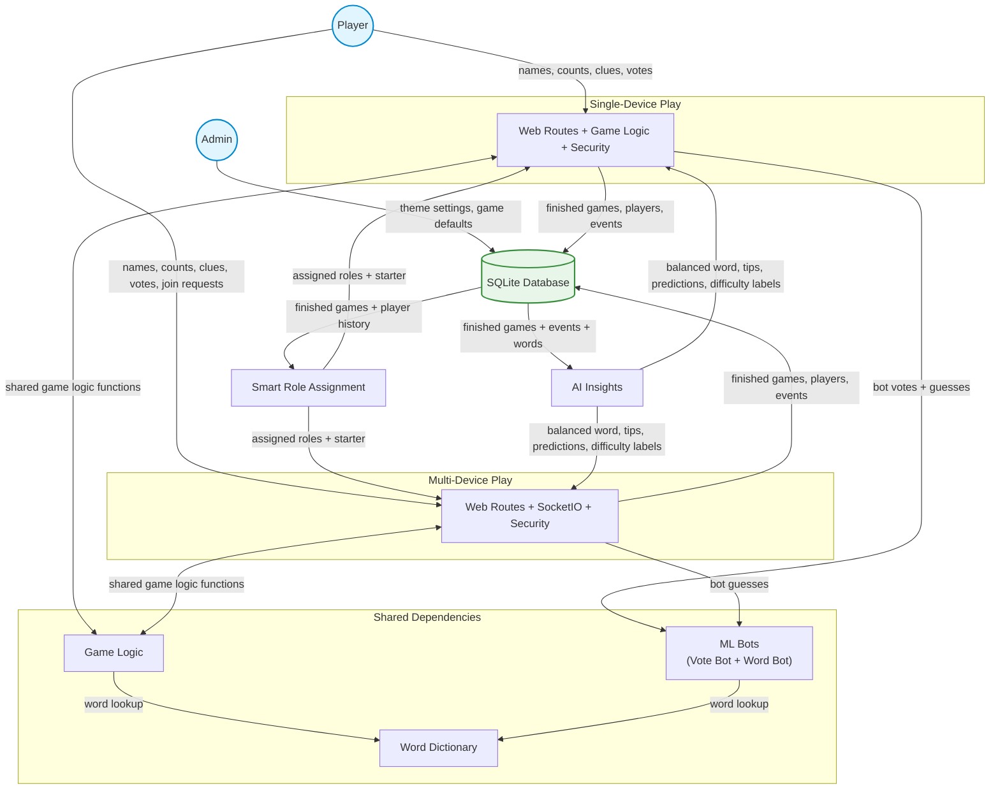

# Level 1 Data Flow Diagram

```mermaid
flowchart TD
    P(("Player")):::entity
    A(("Admin")):::entity
    DB[("SQLite Database")]:::store

    subgraph SD["Single-Device Play"]
        SD_R["Web Routes + Game Logic + Security"]
    end

    subgraph MD["Multi-Device Play"]
        MD_R["Web Routes + SocketIO + Security"]
    end

    SRA["Smart Role Assignment"]
    AI["AI Insights"]

    subgraph Shared["Shared Dependencies"]
        GL["Game Logic"]
        WORDS["Word Dictionary"]
        BOTS["ML Bots\n(Vote Bot + Word Bot)"]
    end

    P -->|"names, counts, clues, votes"| SD_R
    P -->|"names, counts, clues, votes, join requests"| MD_R
    A -->|"theme settings, game defaults"| DB

    SRA -->|"assigned roles + starter"| SD_R
    SRA -->|"assigned roles + starter"| MD_R
    AI -->|"balanced word, tips, predictions, difficulty labels"| SD_R
    AI -->|"balanced word, tips, predictions, difficulty labels"| MD_R

    SD_R <-->|"shared game logic functions"| GL
    MD_R <-->|"shared game logic functions"| GL

    SD_R -->|"finished games, players, events"| DB
    MD_R -->|"finished games, players, events"| DB

    DB -->|"finished games + player history"| SRA
    DB -->|"finished games + events + words"| AI

    GL -->|"word lookup"| WORDS
    SD_R -->|"bot votes + guesses"| BOTS
    MD_R -->|"bot guesses"| BOTS
    BOTS -->|"word lookup"| WORDS

    classDef entity fill:#e1f5fe,stroke:#0288d1,stroke-width:2px
    classDef process fill:#fff3e0,stroke:#f57c00,stroke-width:2px
    classDef store fill:#e8f5e9,stroke:#388e3c,stroke-width:2px
```
