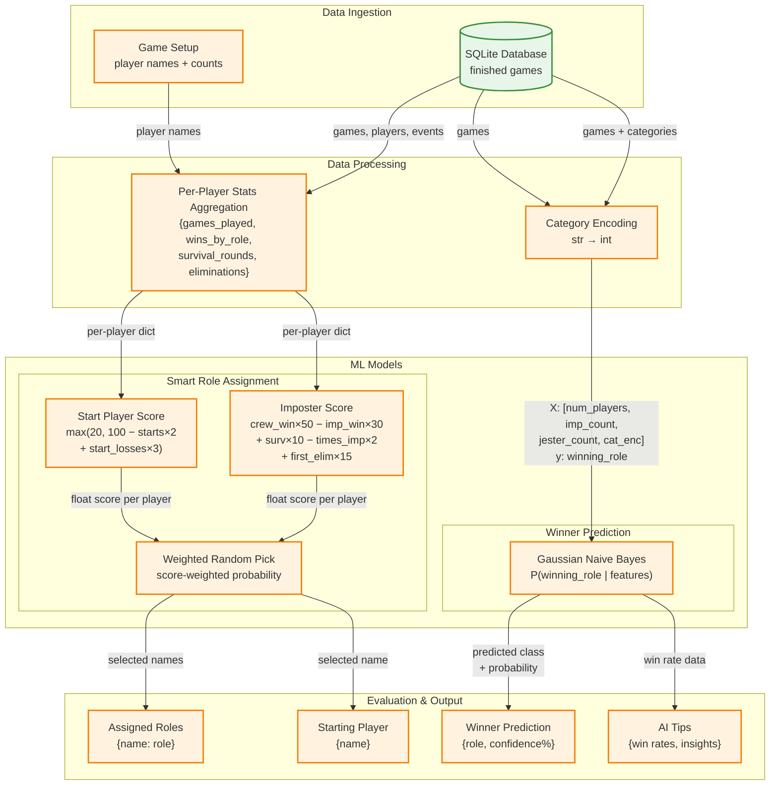

# ML Integration — Data Flowchart

```mermaid
flowchart TD
    subgraph Input["Data Ingestion"]
        DB[("SQLite Database\nfinished games")]:::store
        SETUP["Game Setup\nplayer names + counts"]:::process
    end

    subgraph Processing["Data Processing"]
        STATS["Per-Player Stats Aggregation\n{games_played, wins_by_role,\nsurvival_rounds, eliminations}"]:::process
        CAT_FEAT["Category Encoding\nstr → int"]:::process
    end

    subgraph Models["ML Models"]
        subgraph SRA["Smart Role Assignment"]
            IMP_SCORE["Imposter Score\ncrew_win×50 − imp_win×30\n+ surv×10 − times_imp×2\n+ first_elim×15"]:::process
            START_SCORE["Start Player Score\nmax(20, 100 − starts×2\n+ start_losses×3)"]:::process
            WEIGHTED["Weighted Random Pick\nscore-weighted probability"]:::process
        end

        subgraph NB["Winner Prediction"]
            GAUSS["Gaussian Naive Bayes\nP(winning_role | features)"]:::process
        end
    end

    subgraph Output["Evaluation & Output"]
        ROLES["Assigned Roles\n{name: role}"]:::process
        STARTER["Starting Player\n{name}"]:::process
        PRED["Winner Prediction\n{role, confidence%}"]:::process
        TIPS["AI Tips\n{win rates, insights}"]:::process
    end

    %% Data flow connections
    DB -->|"games, players, events"| STATS
    DB -->|"games + categories"| CAT_FEAT
    SETUP -->|"player names"| STATS

    STATS -->|"per-player dict"| IMP_SCORE
    STATS -->|"per-player dict"| START_SCORE

    IMP_SCORE -->|"float score per player"| WEIGHTED
    START_SCORE -->|"float score per player"| WEIGHTED
    WEIGHTED -->|"selected names"| ROLES
    WEIGHTED -->|"selected name"| STARTER

    DB -->|"games"| CAT_FEAT
    CAT_FEAT -->|"X: [num_players, imp_count,\njester_count, cat_enc]\ny: winning_role"| GAUSS
    GAUSS -->|"predicted class\n+ probability"| PRED
    GAUSS -->|"win rate data"| TIPS

    classDef store fill:#e8f5e9,stroke:#388e3c,stroke-width:2px
    classDef process fill:#fff3e0,stroke:#f57c00,stroke-width:2px
```
