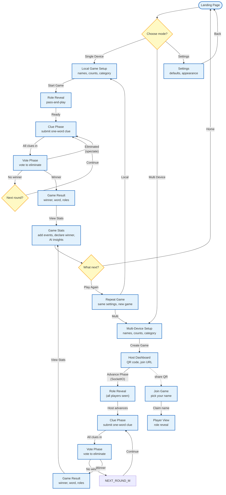

# User Decision Flowchart

```mermaid
flowchart TD
    START([Landing Page]):::page
    CHOOSE_MODE{Choose mode?}:::decision
    SETUP_PAGE["Local Game Setup\nnames, counts, category"]:::page
    MULTI_SETUP["Multi-Device Setup\nnames, counts, category"]:::page
    SETTINGS_PAGE["Settings\ndefaults, appearance"]:::page

    START --> CHOOSE_MODE
    CHOOSE_MODE -->|"Single Device"| SETUP_PAGE
    CHOOSE_MODE -->|"Multi Device"| MULTI_SETUP
    CHOOSE_MODE -->|"Settings"| SETTINGS_PAGE
    SETTINGS_PAGE -->|"Back"| START

    REVEAL["Role Reveal\npass-and-play"]:::page
    SETUP_PAGE -->|"Start Game"| REVEAL

    HOST_DASH["Host Dashboard\nQR code, join URL"]:::page
    MULTI_SETUP -->|"Create Game"| HOST_DASH
    HOST_DASH -->|"Advance Phase\n(SocketIO)"| REVEAL_HOST

    JOIN_PAGE["Join Game\npick your name"]:::page
    HOST_DASH -.->|"share QR"| JOIN_PAGE
    JOIN_PAGE -->|"Claim name"| PLAYER_VIEW

    PLAYER_VIEW["Player View\nrole reveal"]:::page
    REVEAL_HOST["Role Reveal\n(all players seen)"]:::page
    REVEAL -->|"Ready"| CLUE_PHASE
    REVEAL_HOST -->|"Host advances"| CLUE_PHASE_M

    CLUE_PHASE["Clue Phase\nsubmit one-word clue"]:::page
    CLUE_PHASE_M["Clue Phase\nsubmit one-word clue"]:::page

    CLUE_PHASE -->|"All clues in"| VOTE_PHASE
    CLUE_PHASE_M -->|"All clues in"| VOTE_PHASE_M

    VOTE_PHASE["Vote Phase\nvote to eliminate"]:::page
    VOTE_PHASE_M["Vote Phase\nvote to eliminate"]:::page

    NEXT_ROUND{Next round?}:::decision
    VOTE_PHASE -->|"No winner"| NEXT_ROUND
    NEXT_ROUND -->|"Continue"| CLUE_PHASE

    VOTE_PHASE_M -->|"No winner"| NEXT_ROUND_M
    VOTE_PHASE_M -->|"Winner"| RESULT_M
    NEXT_ROUND_M -->|"Continue"| CLUE_PHASE_M

    VOTE_PHASE -->|"Winner"| RESULT
    VOTE_PHASE -->|"Eliminated\n(spectate)"| CLUE_PHASE

    RESULT["Game Result\nwinner, word, roles"]:::page
    RESULT_M["Game Result\nwinner, word, roles"]:::page

    RESULT -->|"View Stats"| STATS_PAGE
    RESULT_M -->|"View Stats"| STATS_PAGE

    POST_GAME{What next?}:::decision
    STATS_PAGE["Game Stats\nadd events, declare winner,\nAI insights"]:::page
    STATS_PAGE --> POST_GAME

    POST_GAME -->|"Play Again"| REPLAY
    POST_GAME -->|"Home"| START

    REPLAY["Repeat Game\nsame settings, new game"]:::page
    REPLAY -->|"Local"| SETUP_PAGE
    REPLAY -->|"Multi"| MULTI_SETUP

    classDef page fill:#e3f2fd,stroke:#1565c0,stroke-width:2px
    classDef decision fill:#fff9c4,stroke:#f9a825,stroke-width:2px
```
