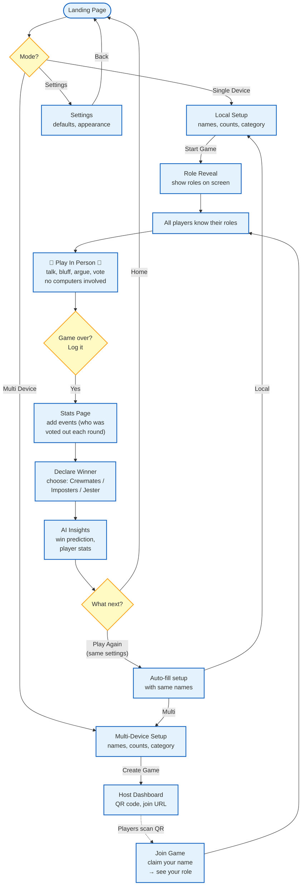

# User Decision Flowchart

```mermaid
flowchart TD
    START([Landing Page]):::page
    CHOOSE_MODE{Mode?}:::decision
    SETUP_PAGE["Local Setup\nnames, counts, category"]:::page
    MULTI_SETUP["Multi-Device Setup\nnames, counts, category"]:::page
    SETTINGS_PAGE["Settings\ndefaults, appearance"]:::page

    START --> CHOOSE_MODE
    CHOOSE_MODE -->|"Single Device"| SETUP_PAGE
    CHOOSE_MODE -->|"Multi Device"| MULTI_SETUP
    CHOOSE_MODE -->|"Settings"| SETTINGS_PAGE
    SETTINGS_PAGE -->|"Back"| START

    REVEAL["Role Reveal\nshow roles on screen"]:::page
    SETUP_PAGE -->|"Start Game"| REVEAL

    HOST_DASH["Host Dashboard\nQR code, join URL"]:::page
    MULTI_SETUP -->|"Create Game"| HOST_DASH

    JOIN_PAGE["Join Game\nclaim your name\n→ see your role"]:::page
    HOST_DASH -.->|"Players scan QR"| JOIN_PAGE

    ROLES_SEEN["All players know their roles"]:::page
    REVEAL --> ROLES_SEEN
    JOIN_PAGE --> ROLES_SEEN

    PLAY_IN_PERSON["🎲  Play In Person  🎲\ntalk, bluff, argue, vote\nno computers involved"]:::page

    ROLES_SEEN --> PLAY_IN_PERSON

    ENTER_EVENTS{"Game over?\nLog it"}:::decision
    PLAY_IN_PERSON --> ENTER_EVENTS

    STATS_PAGE["Stats Page\nadd events (who was\nvoted out each round)"]:::page
    ENTER_EVENTS -->|"Yes"| STATS_PAGE

    DECLARE_WINNER["Declare Winner\nchoose: Crewmates /\nImposters / Jester"]:::page
    STATS_PAGE --> DECLARE_WINNER

    VIEW_INSIGHTS["AI Insights\nwin prediction,\nplayer stats"]:::page
    DECLARE_WINNER --> VIEW_INSIGHTS

    WHAT_NEXT{What next?}:::decision
    VIEW_INSIGHTS --> WHAT_NEXT

    WHAT_NEXT -->|"Play Again\n(same settings)"| REPLAY
    WHAT_NEXT -->|"Home"| START

    REPLAY["Auto-fill setup\nwith same names"]:::page
    REPLAY -->|"Local"| SETUP_PAGE
    REPLAY -->|"Multi"| MULTI_SETUP

    classDef page fill:#e3f2fd,stroke:#1565c0,stroke-width:2px
    classDef decision fill:#fff9c4,stroke:#f9a825,stroke-width:2px
```
